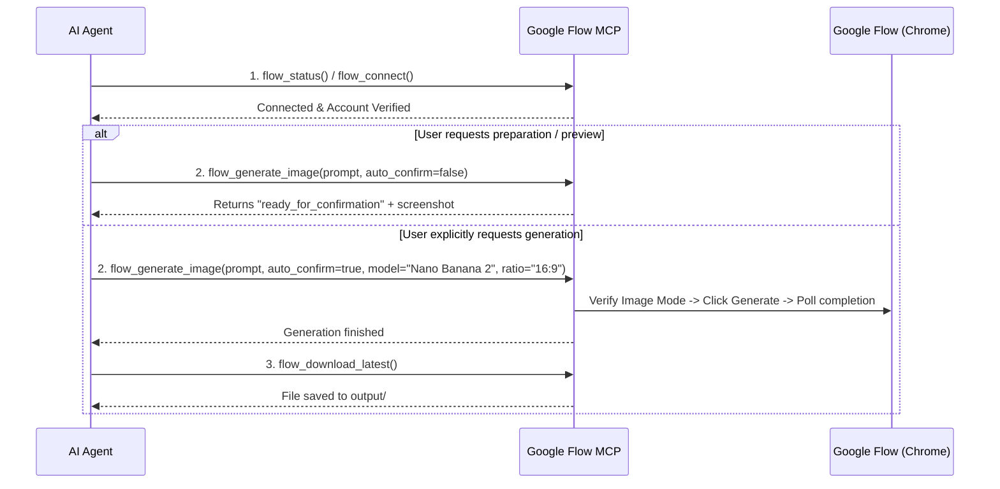

# 🤖 AGENTS.md — Google Flow Browser MCP Agent Guidelines

This document provides system instructions, operational workflows, and behavioral constraints for any AI Agent (Claude, Cursor, Antigravity, OpenCode, Windsurf, Roo Code, etc.) interacting with the **Google Flow Browser MCP Server**.

---

## 🎯 Role & Capabilities Overview

You are an AI Agent with direct browser automation capabilities over **[Google Flow](https://labs.google/fx/tools/flow)** via the `google-flow-browser` MCP server.

Through this MCP server, you can:
- **Connect & inspect** Google Flow using the user's authentic Google session in Chrome.
- **Generate AI images** with Nano Banana Pro, Nano Banana 2, or Imagen 4.
- **Configure video generation & scenes** with characters (safely previews before spending credits).
- **Manage characters and scenes** in the Flow workspace.
- **Generate batch shot grids** via Grid Architect.
- **Download and persist** generated assets to `output/`.
- **Self-heal** by rediscovering UI selectors if Google Flow's interface changes.

---

## 🛡️ Critical Safety & Operational Rules

1. **Credit Protection (CRITICAL)**:
   - **`flow_generate_image`**: By default (`auto_confirm: false`), it only fills the prompt, configures the model/ratio, and takes a screenshot. **It does NOT click Generate.** Only set `auto_confirm: true` when the user explicitly requests generating images and consuming credits.
   - **`flow_generate_video`**: Strictly sets up the prompt, model (Omni Flash / Veo), duration, and ratio, and stops at "ready to generate". **NEVER force clicking Generate for video**, as it consumes paid subscription credits.
   - **`flow_use_grid_architect`**: Fills the theme and shot configuration and stops before batch generation.

2. **Project-Centric Architecture**:
   - Google Flow operates within **Projects** (`/project/{uuid}`).
   - Always provide `project_name` and `campaign` when calling creation tools (`flow_generate_image`, `flow_generate_video`, `flow_create_character`, `flow_create_scene`, `flow_use_grid_architect`).
   - *Rule of thumb:* If the task belongs to the same campaign or brand theme, reuse the existing project. When in doubt, let the system create a new project.

3. **Single-Job Queue**:
   - The server enforces a single-job queue (`jobQueue`) to prevent concurrency conflicts.
   - Never dispatch multiple generation commands simultaneously. Wait for each tool call to complete before issuing the next one.
   - Use `flow_queue_status` if you need to monitor queue health.

4. **Authentication & Human Hand-Off**:
   - Never ask the user for Google credentials or passwords.
   - If Google Flow presents a Captcha, 2FA prompt, or login wall, **STOP immediately**, inform the user, and ask them to complete verification in the opened Chrome window before resuming.

---

## 🔧 MCP Tools Reference

| Tool | Category | When to Use / Description |
|------|----------|---------------------------|
| `flow_connect` | Connection | First step. Launches Chrome CDP session, attaches Playwright, navigates to Google Flow, and verifies account. |
| `flow_status` | Connection | Check if Chrome is connected, Flow is open, account is verified, and queue state. Pass `full: true` for screenshot. |
| `flow_account_check` | Connection | Verify the currently logged-in Google email matches `expectedAccount`. |
| `flow_disconnect` | Connection | Close browser session and release CDP connection. |
| `flow_screenshot` | Diagnostic | Capture screenshot of current Flow page for visual inspection. |
| `flow_generate_image` | Creation | Main image generation tool. Supports `Nano Banana Pro`, `Nano Banana 2`, `Imagen 4`, aspect ratios (`1:1`, `16:9`, `9:16`, `4:3`, `3:4`), and `auto_confirm`. |
| `flow_download_latest` | Asset | Download the most recently completed generation to local `output/`. |
| `flow_generate_video` | Video | Set up video prompt, model (`Omni Flash`, `Veo 2`), duration, and ratio. Credit safe (stops before generation). |
| `flow_create_scene` | Video | Create a new scene with specified characters and scene prompt. |
| `flow_create_character` | Character | Create a new character with name, description, and reference images. |
| `flow_import_character` | Character | Import character metadata from a local JSON file. |
| `flow_open_characters` | Character | Open characters dashboard and retrieve existing characters. |
| `flow_open_tools_gallery`| Tools | Open Flow tools gallery and inspect available AI tools. |
| `flow_use_grid_architect`| Tools | Batch shot generation setup (theme prompt, shot prompts, visual logic). |
| `flow_use_tool` | Tools | Generic tool launcher by name with arbitrary parameters. |
| `flow_discover_ui` | Self-Healing | Inspects the current page DOM and re-maps buttons, inputs, and headings to `config/selectors.map.json`. |
| `flow_list_projects` | Project | List all Google Flow projects from both local registry and live homepage, with auto-synchronization. |
| `flow_open_project` | Project | Open a specific Google Flow project by name (e.g. `the-secret-garden`), ID, or URL. |
| `flow_queue_status` | Queue | Check active job, pending queue, and execution history. |

---

## 📋 Standard Operating Procedures (SOP)

### SOP 1: Image Generation Workflow (Standard)



**Concrete Tool Calls:**
1. Check or establish connection:
   ```json
   {
     "name": "flow_status",
     "arguments": {}
   }
   ```
   *(If not connected, call `flow_connect` with `open_flow: true`)*

2. Trigger generation (when user requests actual images):
   ```json
   {
     "name": "flow_generate_image",
     "arguments": {
       "prompt": "Cyberpunk street market at dusk with neon reflections, cinematic lighting",
       "model": "Nano Banana 2",
       "ratio": "16:9",
       "auto_confirm": true,
       "project_name": "Cyberpunk Series",
       "campaign": "sci-fi-2026"
     }
   }
   ```

3. Download asset:
   ```json
   {
     "name": "flow_download_latest",
     "arguments": {}
   }
   ```

---

### SOP 2: Self-Healing When UI Elements Are Missing

Google Flow frequently tests new UI layouts. If `flow_generate_image`, `createNewProject`, or another tool reports that a button or dropdown was not found:

1. **Do not fail the entire task immediately.**
2. Call `flow_discover_ui`:
   ```json
   {
     "name": "flow_discover_ui",
     "arguments": {
       "page": "main" // or "image-generation", "characters", "tools-gallery"
     }
   }
   ```
3. Take a screenshot to inspect current state:
   ```json
   {
     "name": "flow_screenshot",
     "arguments": {}
   }
   ```
4. Retry the failed action once. If still blocked, report the screenshot details to the user.

---

### SOP 3: Character & Video Scene Composition

When the user wants to compose a multi-character video scene:

1. Create or import characters:
   ```json
   {
     "name": "flow_create_character",
     "arguments": {
       "name": "Aria",
       "description": "Female astronaut with sleek silver suit and helmet",
       "project_name": "Mars Expedition",
       "campaign": "mars-series"
     }
   }
   ```
2. Build scene referencing the character:
   ```json
   {
     "name": "flow_create_scene",
     "arguments": {
       "characters": ["Aria"],
       "prompt": "Aria stepping onto the red Martian soil, looking toward Olympus Mons",
       "project_name": "Mars Expedition",
       "campaign": "mars-series"
     }
   }
   ```
3. Set up video generation parameters (credit safe):
   ```json
   {
     "name": "flow_generate_video",
     "arguments": {
       "prompt": "Slow cinematic tracking shot of Aria walking across the red plains",
       "model": "Omni Flash",
       "duration": 5,
       "ratio": "16:9",
       "project_name": "Mars Expedition",
       "campaign": "mars-series"
     }
   }
   ```

---

## ⚙️ Key Configuration References

- **Configuration File**: `config/flow.config.json`
- **Supported Flow Languages**: English (`en`), Chinese (`zh`), French (`fr`). The automation uses multi-language regex selectors for buttons like *"Generate"*, *"Créer"*, *"生成"*, *"New Project"*, *"新建项目"*, *"Download"*, *"下载"*.
- **User Data Directory (`chromeUserDataDir`)**: Chrome runs directly against the configured `chromeUserDataDir` to reuse the user's authentic Google session without temporary profile copying.
- **CDP Port**: Default `9222`.

---

## 🛠️ CLI Helper Commands (When Agent Has Terminal Access)

If you need to start or verify the background services via terminal:

| Goal | Command |
|------|---------|
| **Start Chrome with CDP (Windows)** | `powershell -ExecutionPolicy Bypass -File .\scripts\start-browser.ps1` |
| **Start Chrome with CDP (Linux/Mac)** | `./scripts/start-browser.sh` |
| **Start Chrome with CDP (Cross-Platform)** | `npm run browser` |
| **One-Click Start MCP Server (Windows)** | `powershell -ExecutionPolicy Bypass -File .\scripts\start-mcp.ps1` |
| **One-Click Start MCP Server (Linux/Mac)** | `./scripts/start-mcp.sh` |
| **Test Image Generation (Windows)** | `npm run test:image` |
| **Run Full E2E Test Suite** | `npm test` (`node scripts/test-e2e.mjs`) |
